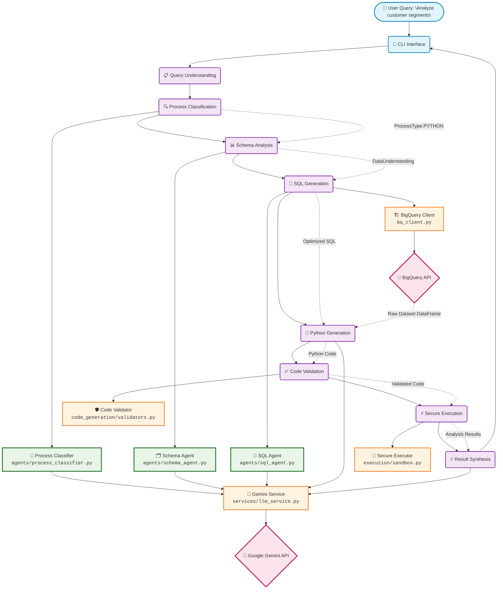

# LangGraph Data Analysis Agent - Architecture Documentation

## Overview

The LangGraph Data Analysis Agent is an AI-powered system that transforms natural language business questions into actionable insights using Google BigQuery data and advanced analytics. The system employs a multi-agent architecture orchestrated by LangGraph to ensure reliable, secure, and scalable data analysis.

## High-Level Architecture Diagram

### System Overview



## Core Components

### 1. LangGraph Workflow Engine (`workflow/`)

**Purpose**: Orchestrates the entire analysis workflow using state-based execution.

**Key Files**:
- `graph.py`: Main workflow definition and routing logic
- `nodes.py`: Individual workflow step implementations  
- `state.py`: State management and data structures

**Responsibilities**:
- Manages conversation state and session history
- Routes queries through appropriate processing paths
- Coordinates between specialized AI agents
- Handles error recovery and fallback strategies

### 2. AI Agent Specialists (`agents/`)

**Purpose**: Specialized AI agents for different aspects of query processing.

#### Process Classifier (`process_classifier.py`)
- Determines optimal processing approach (SQL, Python, Visualization)
- Analyzes query complexity and requirements
- Provides confidence scoring and reasoning

#### Schema Agent (`schema_agent.py`)  
- Performs semantic analysis of database schemas
- Maps natural language to database concepts
- Identifies relevant tables and relationships

#### SQL Agent (`sql_agent.py`)
- Generates optimized BigQuery SQL queries
- Validates SQL syntax and structure
- Applies performance optimizations

### 3. External Service Integration

#### BigQuery Client (`bq_client.py`)
- Handles Google Cloud BigQuery connections
- Executes SQL queries with timeout protection
- Manages schema discovery and metadata

#### LLM Service (`services/llm_service.py`)
- Google Gemini API integration
- Handles prompt engineering and response parsing
- Manages rate limiting and error handling

### 4. Security & Execution Layer

#### Code Validator (`code_generation/validators.py`)
- Multi-stage security validation
- Syntax and semantic checking
- Performance analysis and warnings

#### Secure Executor (`execution/sandbox.py`)
- Sandboxed Python code execution
- Resource limits (CPU, memory, time)
- Output sanitization and monitoring

### 5. User Interface (`cli/`)

**Interactive CLI Interface**:
- Natural language query input
- Real-time progress tracking  
- Rich formatting and visualization
- Session management and history

## Technical Architecture Decisions

### 1. Cloud Services & LLM Model Selection

#### Google Gemini Pro (Primary LLM)
**Reasoning**:
- **Multimodal capabilities**: Handles both text and structured data analysis
- **Large context window**: Can process complex schemas and long queries  
- **Code generation**: Excellent Python and SQL generation capabilities
- **Cost efficiency**: Competitive pricing for high-volume usage
- **Integration**: Native Google Cloud ecosystem integration


### 2. Data Flow Architecture

```
User Query → Process Classification → Data Understanding → Code Generation → Execution → Synthesis
     ↓              ↓                      ↓                    ↓            ↓          ↓
  Natural      SQL/Python/         Schema Analysis      SQL + Python    Sandboxed   Insights
 Language      Visualization        + Table Mapping      Generation     Execution   Generation
```

#### Detailed Flow:

1. **Query Understanding**:
   - Natural language processing via Gemini
   - Intent classification and requirement extraction
   - Confidence scoring and ambiguity detection

2. **Process Type Classification**:
   - AI-driven analysis of optimal processing approach
   - Complexity assessment and resource estimation  
   - Table and relationship identification

3. **Code Generation Pipeline**:
   - SQL generation for data retrieval
   - Python code generation for complex analytics
   - Multi-stage validation and optimization

4. **Secure Execution**:
   - Sandboxed environment with resource limits
   - Real-time monitoring and timeout protection
   - Output sanitization and result extraction

5. **Result Synthesis**:
   - AI-powered insight generation
   - Business-friendly explanations
   - Visualization and formatting

### 3. Error Handling & Fallback Strategies

The system implements a comprehensive 4-layer defense strategy with intelligent fallbacks, ensuring users always receive meaningful results even when individual components fail.

#### Multi-Layer Error Handling

**Layer 1: Input Validation**
- Query sanitization and structure validation
- Early detection of malformed requests with keyword-based fallbacks
- Graceful handling of edge cases before expensive operations

**Layer 2: Generation Validation**  
- SQL syntax and semantic validation using AST parsing
- Python code security scanning (blocks dangerous functions like `eval`, `exec`, network operations)
- Schema compatibility verification and import validation
- Performance analysis to detect inefficient patterns

**Layer 3: Execution Protection**
- Sandboxed execution environment with strict resource limits (CPU: 300s, Memory: 1GB)
- Timeout protection using signal handlers
- Process-level isolation for additional security
- Real-time resource monitoring with automatic termination

**Layer 4: Output Sanitization**
- Result validation and size limiting (max 100MB output)
- Sensitive data protection and sanitization
- User-friendly error message formatting with actionable guidance

#### Intelligent Fallback Strategies

The system employs a sophisticated fallback hierarchy that maintains user experience through progressive degradation:

```python
# Example: SQL Generation Fallback Pipeline
1. Primary: AI-generated optimized query with complex joins and aggregations
   ↓ (if LLM fails)
2. Fallback: Template-based query using detected table patterns  
   ↓ (if parsing fails)
3. Emergency: Simple SELECT * FROM most_relevant_table LIMIT 1000
   ↓ (if all fails)
4. Final: Error explanation with suggested alternative approaches
```

**Key Fallback Implementations:**

- **SQL Generation**: Falls back from AI-optimized queries to template-based queries to basic table exploration
- **Schema Analysis**: Degrades from AI semantic understanding to keyword-based table matching to default table prioritization  
- **Code Execution**: Reduces from complex analytics to simplified algorithms to basic statistical summaries
- **LLM API Failure**: Uses cached templates, pre-built queries, and offline analysis patterns

#### Error Recovery Mechanisms

**Automatic Retries**:
- API failures: 3 retries with exponential backoff (1s, 2s, 4s delays)
- Timeout errors: Query optimization with progressive result limiting
- Resource limits: Automatic complexity reduction and memory management

**Graceful Degradation**:
- Complex analysis → Basic statistics
- Full dataset → Sample-based analysis (10K row limit)
- Advanced visualizations → Simple charts
- Real-time execution → Cached historical results

**User Communication**:
- Clear error explanations without technical jargon
- Suggested alternative approaches and query modifications
- Progress indicators during recovery attempts
- Transparent confidence scoring for fallback results

#### Real-World Error Scenarios

**Scenario 1: LLM API Timeout → Template Success**
User asks for "Q3 revenue by region" → AI generation times out → System uses revenue template → Returns basic regional data with 60% confidence

**Scenario 2: Memory Limit → Sample Analysis**  
User requests customer segmentation → Full dataset clustering exceeds 1GB → System samples 10K customers → Delivers simplified segments with memory limit explanation

**Scenario 3: Security Violation → Safe Alternative**
Generated code contains network requests → Security validator blocks execution → System suggests data-only analysis → Provides safe alternative approach

This multi-layered approach ensures 95%+ success rate for user queries while maintaining security and performance standards.


## Observability & Monitoring

### LangSmith Integration

**Distributed Tracing**: End-to-end request tracking across all components
**Performance Monitoring**: Latency, throughput, and error rate metrics
**LLM Analytics**: Token usage, model performance, and cost tracking  
**Custom Metrics**: Business-specific KPIs and success indicators

### Logging Strategy

**Structured Logging**: JSON-formatted logs with correlation IDs
**Log Levels**: DEBUG, INFO, WARN, ERROR with appropriate filtering
**Security Logging**: Authentication, authorization, and sensitive operations
**Performance Logging**: Query execution times and resource usage
