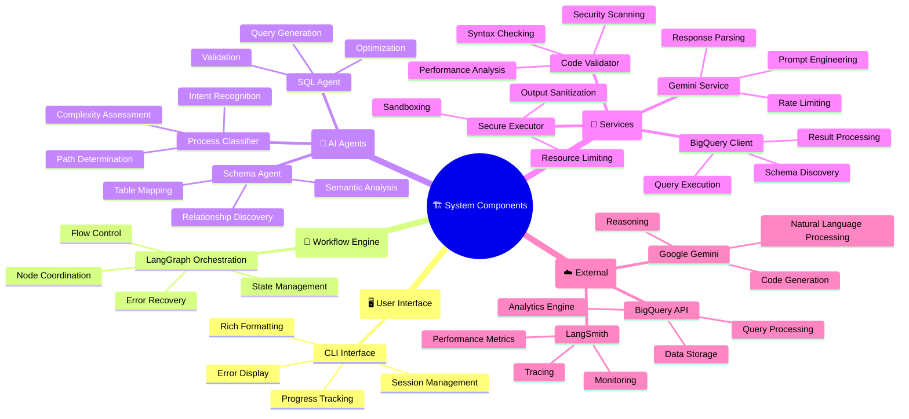

# LangGraph Data Analysis Agent - Architecture Documentation

## Overview

The LangGraph Data Analysis Agent is an AI-powered system that transforms natural language business questions into actionable insights using Google BigQuery data and advanced analytics. The system employs a multi-agent architecture orchestrated by LangGraph to ensure reliable, secure, and scalable data analysis.

## High-Level Architecture Diagram

### System Overview


### Component Responsibility Matrix


## Core Components

### 1. LangGraph Workflow Engine (`workflow/`)

**Purpose**: Orchestrates the entire analysis workflow using state-based execution.

**Key Files**:
- `graph.py`: Main workflow definition and routing logic
- `nodes.py`: Individual workflow step implementations  
- `state.py`: State management and data structures

**Responsibilities**:
- Manages conversation state and session history
- Routes queries through appropriate processing paths
- Coordinates between specialized AI agents
- Handles error recovery and fallback strategies

### 2. AI Agent Specialists (`agents/`)

**Purpose**: Specialized AI agents for different aspects of query processing.

#### Process Classifier (`process_classifier.py`)
- Determines optimal processing approach (SQL, Python, Visualization)
- Analyzes query complexity and requirements
- Provides confidence scoring and reasoning

#### Schema Agent (`schema_agent.py`)  
- Performs semantic analysis of database schemas
- Maps natural language to database concepts
- Identifies relevant tables and relationships

#### SQL Agent (`sql_agent.py`)
- Generates optimized BigQuery SQL queries
- Validates SQL syntax and structure
- Applies performance optimizations

### 3. External Service Integration

#### BigQuery Client (`bq_client.py`)
- Handles Google Cloud BigQuery connections
- Executes SQL queries with timeout protection
- Manages schema discovery and metadata

#### LLM Service (`services/llm_service.py`)
- Google Gemini API integration
- Handles prompt engineering and response parsing
- Manages rate limiting and error handling

### 4. Security & Execution Layer

#### Code Validator (`code_generation/validators.py`)
- Multi-stage security validation
- Syntax and semantic checking
- Performance analysis and warnings

#### Secure Executor (`execution/sandbox.py`)
- Sandboxed Python code execution
- Resource limits (CPU, memory, time)
- Output sanitization and monitoring

### 5. User Interface (`cli/`)

**Interactive CLI Interface**:
- Natural language query input
- Real-time progress tracking  
- Rich formatting and visualization
- Session management and history

## Technical Architecture Decisions

### 1. Cloud Services & LLM Model Selection

#### Google Gemini Pro (Primary LLM)
**Reasoning**:
- **Multimodal capabilities**: Handles both text and structured data analysis
- **Large context window**: Can process complex schemas and long queries  
- **Code generation**: Excellent Python and SQL generation capabilities
- **Cost efficiency**: Competitive pricing for high-volume usage
- **Integration**: Native Google Cloud ecosystem integration

#### Google BigQuery (Data Warehouse)
**Reasoning**:
- **Scalability**: Handles petabyte-scale datasets efficiently
- **Public datasets**: Rich ecommerce data available for demonstration
- **Performance**: Columnar storage optimized for analytics
- **Security**: Enterprise-grade access controls and audit logs
- **SQL compatibility**: Standard SQL interface with extensions

#### LangGraph (Workflow Orchestration)
**Reasoning**:
- **State management**: Reliable state persistence across workflow steps
- **Error recovery**: Built-in retry and fallback mechanisms
- **Observability**: Integration with LangSmith for monitoring
- **Flexibility**: Conditional routing based on query complexity
- **Debugging**: Clear visibility into workflow execution

### 2. Data Flow Architecture

```
User Query → Process Classification → Data Understanding → Code Generation → Execution → Synthesis
     ↓              ↓                      ↓                    ↓            ↓          ↓
  Natural      SQL/Python/         Schema Analysis      SQL + Python    Sandboxed   Insights
 Language      Visualization        + Table Mapping      Generation     Execution   Generation
```

#### Detailed Flow:

1. **Query Understanding**:
   - Natural language processing via Gemini
   - Intent classification and requirement extraction
   - Confidence scoring and ambiguity detection

2. **Process Type Classification**:
   - AI-driven analysis of optimal processing approach
   - Complexity assessment and resource estimation  
   - Table and relationship identification

3. **Code Generation Pipeline**:
   - SQL generation for data retrieval
   - Python code generation for complex analytics
   - Multi-stage validation and optimization

4. **Secure Execution**:
   - Sandboxed environment with resource limits
   - Real-time monitoring and timeout protection
   - Output sanitization and result extraction

5. **Result Synthesis**:
   - AI-powered insight generation
   - Business-friendly explanations
   - Visualization and formatting

### 3. Error Handling & Fallback Strategies

#### Multi-Layer Error Handling

**Layer 1: Input Validation**
- Query sanitization and structure validation
- Early detection of malformed requests
- Graceful handling of edge cases

**Layer 2: Generation Validation**  
- SQL syntax and semantic validation
- Python code security and performance scanning
- Schema compatibility verification

**Layer 3: Execution Protection**
- Resource limit enforcement (CPU: 300s, Memory: 1GB)  
- Timeout handling with graceful degradation
- Error recovery and retry mechanisms

**Layer 4: Output Sanitization**
- Result validation and formatting
- Sensitive data protection
- User-friendly error messaging

#### Fallback Strategies

```python
# Example fallback hierarchy:
1. Primary: AI-generated optimized query
   ↓ (if fails)
2. Fallback: Simplified query template  
   ↓ (if fails)
3. Emergency: Basic schema exploration
   ↓ (if fails) 
4. Final: Error explanation and user guidance
```

**Specific Fallback Cases**:
- **SQL Generation Failure**: Template-based queries with basic aggregations
- **BigQuery Timeout**: Query optimization with result limiting
- **Code Execution Error**: Simplified analysis with core functionality
- **LLM API Failure**: Cached responses and offline analysis modes

#### Error Recovery Mechanisms

**Automatic Retries**:
- API failures: 3 retries with exponential backoff
- Timeout errors: Query optimization and re-execution
- Resource limits: Automatic scaling down of complexity

**Graceful Degradation**:
- Complex analysis → Basic statistics
- Full dataset → Sample-based analysis  
- Advanced visualizations → Simple charts
- Real-time → Cached historical results

**User Communication**:
- Clear error explanations without technical jargon
- Suggested alternative approaches
- Progress indicators during recovery attempts
- Option to retry with modified parameters

## Security Architecture

### Code Execution Security

**Sandboxing**: Isolated execution environment with restricted system access
**Resource Limits**: CPU, memory, and execution time constraints
**Import Restrictions**: Whitelist-based module access control
**Pattern Detection**: Static analysis for malicious code patterns

### Data Security

**Access Control**: BigQuery IAM integration and role-based permissions
**Query Validation**: SQL injection prevention and query sanitization  
**Data Masking**: Automatic PII detection and handling
**Audit Logging**: Complete request/response logging for compliance

### Network Security

**API Security**: Secure API key management and rotation
**TLS Encryption**: All external communications encrypted
**Rate Limiting**: Protection against abuse and DoS attacks
**Input Validation**: Comprehensive request sanitization

## Performance & Scalability

### Optimization Strategies

**Query Optimization**: 
- Automatic LIMIT clause addition
- Index usage recommendations
- Partitioning-aware query generation

**Caching Strategy**:
- Schema metadata caching (24h TTL)
- Frequent query result caching (1h TTL)  
- LLM response caching for common patterns

**Resource Management**:
- Connection pooling for BigQuery
- Async execution for independent operations
- Memory-efficient DataFrame processing

### Scalability Considerations

**Horizontal Scaling**: Stateless design enables multiple instance deployment
**Load Distribution**: LangGraph state management supports load balancing  
**Resource Allocation**: Dynamic scaling based on query complexity
**Monitoring Integration**: LangSmith provides performance insights and bottleneck identification

## Observability & Monitoring

### LangSmith Integration

**Distributed Tracing**: End-to-end request tracking across all components
**Performance Monitoring**: Latency, throughput, and error rate metrics
**LLM Analytics**: Token usage, model performance, and cost tracking  
**Custom Metrics**: Business-specific KPIs and success indicators

### Logging Strategy

**Structured Logging**: JSON-formatted logs with correlation IDs
**Log Levels**: DEBUG, INFO, WARN, ERROR with appropriate filtering
**Security Logging**: Authentication, authorization, and sensitive operations
**Performance Logging**: Query execution times and resource usage

## Deployment Architecture

### Environment Configuration

**Development**: Local execution with sample datasets
**Staging**: Cloud deployment with production-like data  
**Production**: Full-scale deployment with monitoring and alerting

### Configuration Management

**Environment Variables**: Secure credential and configuration management
**Feature Flags**: Dynamic system behavior control
**Resource Limits**: Environment-specific performance tuning
**Monitoring Thresholds**: Adaptive alerting based on usage patterns

This architecture provides a robust, secure, and scalable foundation for AI-powered data analysis while maintaining flexibility for future enhancements and integrations.