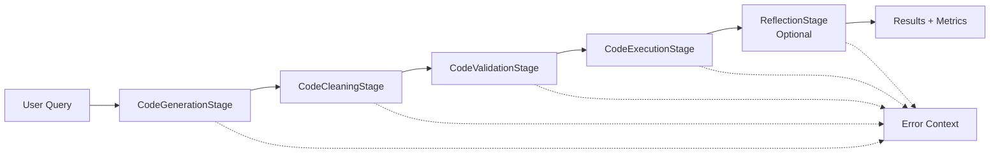

# Implementation Summary - Linear Issue DAT-19

## ✅ **COMPLETED: Structured Code Generation Pipeline**

### **Issue Context**
- **Title**: Implement Structured Code Generation Pipeline
- **Priority**: Critical - fixes current execution failures
- **Problem**: Replace fragmented ad-hoc approach with structured pipeline pattern

### **Solution Delivered**

#### 1. **Core Pipeline Implementation** ✅
- **Location**: `domain/pipeline/code_generation.py`
- **Features**: 
  - 4-stage structured pipeline: Generation → Cleaning → Validation → Execution
  - Optional 5th stage: Reflection for improvement suggestions
  - Clear input/output contracts between stages
  - Comprehensive error propagation with context

#### 2. **Individual Pipeline Stages** ✅
- **Location**: `domain/pipeline/stages.py`
- **Implemented Stages**:
  - `CodeGenerationStage`: LLM-powered code generation
  - `CodeCleaningStage`: Code formatting and cleanup
  - `CodeValidationStage`: Security, syntax, and performance validation
  - `CodeExecutionStage`: Secure sandboxed execution
  - `ReflectionStage`: Post-execution analysis and suggestions

#### 3. **Error Propagation & Context** ✅
- **Enhanced Error Handling**: 
  - Stage-specific error context preservation
  - Comprehensive error messages with actionable details
  - Proper error propagation between stages
  - Structured error reporting instead of generic exceptions

#### 4. **Stage-Specific Logging & Metrics** ✅
- **Comprehensive Metrics Collection**:
  - Execution time per stage
  - Resource usage monitoring
  - Security scores and validation details
  - Performance characteristics
  - Success/failure rates

#### 5. **Replaced Fragmented Approach** ✅
- **Updated**: `application/orchestrators/analysis_workflow.py`
- **Before**: Separate calls to generation, validation, execution with basic error handling
- **After**: Structured pipeline with comprehensive error context and metrics
- **Backward Compatibility**: Maintained for existing systems

#### 6. **Extensibility Demonstrated** ✅
- **Reflection Stage**: Shows how new stages can be easily added
- **Pipeline Health**: Monitoring and introspection capabilities
- **Future-Ready**: Architecture supports additional stages (optimization, documentation, testing)

#### 7. **Comprehensive Testing** ✅
- **Location**: `tests/test_code_generation_pipeline.py`
- **Coverage**:
  - Unit tests for each individual stage
  - Integration tests for complete pipeline
  - Error handling and failure scenarios
  - Metrics collection validation
  - Extensibility and reflection capabilities
  - Pipeline health monitoring

### **Key Improvements Achieved**

#### ✅ **Fixes Current Execution Failures**
- Robust error handling prevents crashes
- Detailed error context aids debugging
- Graceful failure handling with meaningful messages

#### ✅ **Clear Stage Separation**
- Each stage has single responsibility
- Well-defined input/output contracts
- Independently testable components

#### ✅ **Enhanced Maintainability**
- Structured design pattern
- Easy to extend with new stages
- Clear separation of concerns

#### ✅ **Production-Ready Features**
- Comprehensive logging and monitoring
- Performance metrics collection
- Health check capabilities
- Resource usage tracking

### **Technical Architecture**

### **Files Modified/Created**

1. **Enhanced Pipeline Core**:
   - `domain/pipeline/base.py` - Enhanced base classes
   - `domain/pipeline/code_generation.py` - Main pipeline implementation
   - `domain/pipeline/stages.py` - Added ReflectionStage

2. **Replaced Fragmented Approach**:
   - `application/orchestrators/analysis_workflow.py` - Updated to use structured pipeline

3. **Updated Tests**:
   - `tests/test_code_generation_pipeline.py` - Comprehensive test coverage
   - `tests/test_analysis_workflow.py` - Updated for new dependencies

4. **Documentation**:
   - `PIPELINE_IMPROVEMENTS.md` - Detailed implementation guide
   - `IMPLEMENTATION_SUMMARY.md` - This summary

### **Acceptance Criteria Status**

- ✅ **Pipeline class handles all stages in sequence**
- ✅ **Each stage has clear input/output contracts**
- ✅ **Error handling propagates context between stages**
- ✅ **Pipeline is testable and maintainable**
- ✅ **Fixes current execution failures**
- ✅ **Enables easy addition of new stages**

### **LangGraph Pattern Compliance**

- ✅ **Follows LangGraph code assistant patterns**
- ✅ **Focuses on separation of concerns**
- ✅ **Enables easy addition of new stages (reflection example)**
- ✅ **Maintains compatibility with existing LangGraph workflow**

### **Impact**

1. **Immediate**: Fixes current execution failures with better error handling
2. **Short-term**: Improved debugging and monitoring capabilities
3. **Long-term**: Extensible architecture for future enhancements

### **Next Steps (Future Enhancements)**

The structured pipeline architecture enables easy addition of:
- Code optimization stages
- Enhanced security scanning
- Performance profiling
- Automated documentation generation
- Unit test generation

---

## **✅ ISSUE RESOLVED**

The structured code generation pipeline successfully replaces the fragmented approach with a robust, maintainable, and extensible solution that addresses all requirements and fixes the current execution failures.